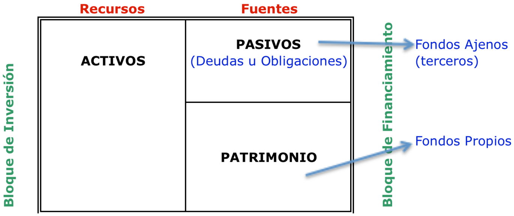

## Estados financieros

### Estados financieros
¿Que es un estado financciero?

Es un documento que muestra la situacion financiera de una empresa en un momento determinado. Los estados financieros son utilizados por los administradores, accionistas, inversionistas, entidades financieras y otros interesados para conocer la situacion financiera de la empresa.

¿Cuándo se elaboran los estados financieros?

Los estados financieros son elaborados al final de un periodo contable, que puede ser un mes, un trimestre o un año.

¿Que normas regulan la elaboracion de los estados financieros?

En Chile las normas actuales se llaman IFRS (International Financial Reporting Standards) y son emitidas por el IASB (International Accounting Standards Board).

¿Que es la IFRS?

La IFRS es un conjunto de normas internacionales de contabilidad que establecen como se deben reconocer, medir, presentar y revelar los hechos economicos y financieros de una empresa.

¿Que es el IASB?

El IASB es una organizacion independiente que emite las normas internacionales de contabilidad.

### Estado Economico - Financiero

El informe elaborado al termino de un periodo contable, sirve para que los usuarios internos y externos de la empresa tomen decisiones
en base a la situacion financiera en un momento determinado de la empresa. 

¿Que es un periodo contable?

Es el tiempo en el que se registran las operaciones economicas y financieras de una empresa. Puede ser un mes, un trimestre o un año.

Informes financieros basicos de contabilidad
- Estado de Situacion Financiera (Balance General)
- Estado integral de resultados
- Estado de Flujo de Efectivo
- Estado de Cambios en el Patrimonio Neto
- Notas Expliicativas a los Estados Financieros

### Estado de Situacion Financiera (Balance General)

¿Que es un informe de balance?

Es un documento que muestra la situacion financiera de una empresa en un momento determinado. El balance general se compone de dos partes: activo y pasivo.

¿Que es un recurso?

Es un bien o derecho que posee la empresa. Los recursos se dividen en dos grupos: activo y pasivo.

¿Que es un activo?

Es un recurso que posee la empresa. Los activos se dividen en dos grupos: activo corriente y activo no corriente.

¿Que es un pasivo?

Es una deuda que posee la empresa. Los pasivos se dividen en dos grupos: pasivo corriente y pasivo no corriente.

¿Que es una fuente?

Es el origen de los recursos de la empresa. Las fuentes se dividen en dos grupos: patrimonio y pasivo.

¿Que es el patrimonio?

Es el capital que aportan los socios a la empresa (Fondos propios).

¿Que es un bloque de inversion y el bloque de financiamiento?

El bloque de inversion esta compuesto por el activo y el bloque de financiamiento esta compuesto por el pasivo y el patrimonio. Esto es asi
porque los recursos de la empresa provienen de dos fuentes: inversion y financiamiento.

#### Aporte a la toma de decisiones

1. Liquidez o capacidad de pago: Muestra la capacidad de la empresa para pagar sus deudas a corto plazo.
2. Capital de Trabajo: Muestra la capacidad de la empresa para financiar sus operaciones.
3. Porcentaje de los recursos del negocio que han sido aportados por terceros y por los propios dueños: Muestra la dependencia de la empresa de terceros.
4. Rendimiento o rentabilidad sobre la inversion: Muestra la rentabilidad de la empresa.

#### Estructura Estado de Situacion Financiera

¿Que es un activo corriente?

Son los recursos que se pueden convertir en efectivo en un periodo menor a un año.

¿Que es un activo no corriente?

Son los recursos que no se pueden convertir en efectivo en un periodo menor a un año.

¿Que es un pasivo corriente?

Son las deudas que se deben pagar en un periodo menor a un año.

¿Que es un pasivo no corriente?

Son las deudas que se deben pagar en un periodo mayor a un año.

### Estado de resultados

Es un informe que muestra los ingresos y gastos de una empresa en un periodo determinado. Su contenido corresponde a la acumulacioón
de ingresos economicos, costos expiados y gastos incurridos

¿Que es un ingreso?

Es el valor que recibe la empresa por la venta de un bien o servicio.

¿Que es un costo?

Es el valor que la empresa gasta en la produccion de un bien o servicio.

¿Que es un gasto?

Es el valor que la empresa gasta en la administracion de la empresa.

#### Calculo de la utilidad o perdida

1. Menos: Costos de ventas (Costos de produccion + Gastos de ventas)
2. Igual: Margen Bruto o de contribucion (Ventas - Costos de ventas)
3. Menos: Gastos del periodo (Gastos de administracion + Gastos de ventas + Gastos financieros + Otros gastos)
4. Más: Otros ingresos (Ingresos financieros + Otros ingresos)
5. Igual: Resultado (Utilidad o perdida) del periodo (Margen Bruto - Gastos del periodo + Otros ingresos)

#### Aporte a la toma de decisiones

1. Rentabilidad: Muestra la rentabilidad de la empresa.
2. Evaluar el desempeño de la empresa en un periodo determinado.
3. Medir Riesgos: Muestra la capacidad de la empresa para enfrentar situaciones adversas.
4. Distribucion de dividendos: Muestra la capacidad de la empresa para distribuir dividendos.

¿Que es un dividendo?

Es la parte de las utilidades que se distribuyen a los accionistas.

#### Diferencia entre Estado De Situacion Financiera y Estado Integral de Resultados

* Estado de Situacion Financiera: Muestra la capacidad de la empresa para generar recursos y hacer frente a sus compromisos - Flujo de Usos y Fuentes de recursos.
* Estado Integral de Resultados: Muestra la capacidad de la empresa para generar beneficios economicos futuros

### Notas Explicativas

Son informaciones complementarias que se incluyen en los estados financieros para explicar o aclarar los datos presentados en los estados financieros.

#### Cierre de cuentas

Es el proceso de finalizacion de un periodo contable. Consiste en cerrar las cuentas de ingresos y gastos para determinar la utilidad o perdida del periodo.

¿Como se calcula?

1. Sumar los ingresos y restar los gastos.
2. El resultado es la utilidad o perdida del periodo.

#### Apertura de cuentas

Es el proceso de inicio de un periodo contable. Consiste en abrir las cuentas de ingresos y gastos para registrar las operaciones economicas y financieras de la empresa.

¿Como se calcula?

1. Sumar los ingresos y restar los gastos.
2. El resultado es la utilidad o perdida del periodo.

#### Traspaso del resultado

Es el proceso de transferencia de la utilidad o perdida del periodo al patrimonio de la empresa.

¿Como se calcula?

1. Sumar los ingresos y restar los gastos.
2. El resultado es la utilidad o perdida del periodo.

#### Tratamiento del resultado

Es el proceso de distribucion de la utilidad o perdida del periodo entre los socios de la empresa.

* Ingresos + Ganacias > Gastos + Perdidas = Utilidad del Ejercicio
* Ingresos + Ganacias < Gastos + Perdidas = Perdida del Ejercicio

#### Tratamiento de la utilidad

Cuando en un periodo contable anterior se ha generado una utilidad, se puede decidir:

1. Mantener en la empresa: Se reinvierte en la empresa.
    * Absorcion de perdidas: Se utiliza para compensar perdidas de ejercicios anteriores.
    * Capitalizacion de utilidades: Se utiliza para aumentar el capital de la empresa.
    * Constitucion de reservas: Se utiliza para constituir reservas de capital.
    * Acumuacion: Se utiliza para acumular utilidades en la empresa.

2. Distribuir entre los dueños: Se reparte entre los socios de la empresa.
    * Dividendos: Se reparte entre los accionistas de la empresa.
    * Retiros: Entrega de utilidades los socios de la empresa 

